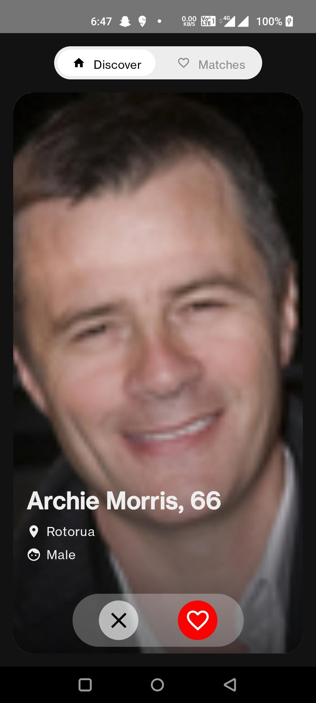
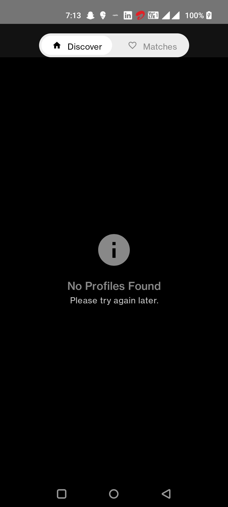
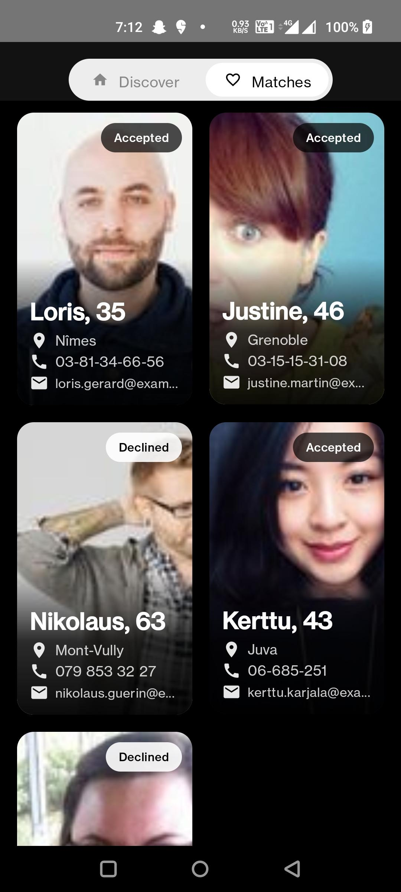
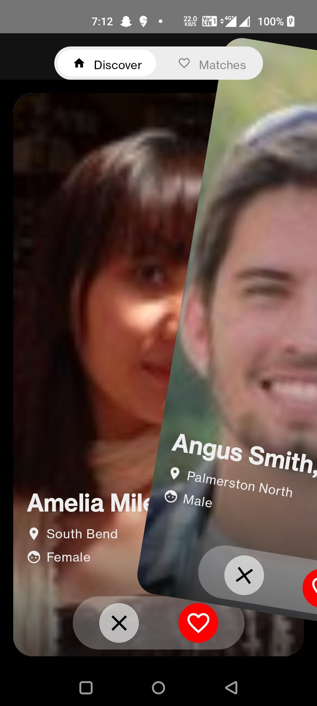

# MatchMate 💕 (Matrimonial App Clone)

MatchMate is an Android app that simulates a matrimonial platform, inspired by apps like Shaadi.com and Tinder. It fetches profiles from a public API, allows users to swipe cards (Accept/Decline), and persistently saves user decisions offline using Room DB.

---

## 📸 Preview
| Discover Screen (Swipe) | Empty State | Matches Screen | Swipe Action |
|-------------------------|-------------|----------------|--------------|
|  |  |  |  |

---

## 📝 Features
1. **API Integration**: Fetch user profiles from [`https://randomuser.me/api/?results=10`](https://randomuser.me/api/?results=10).
2. **Match Cards UI**: Clean and interactive swipeable cards with profile details.
3. **Swipe Gesture**: 
    - Swipe Right / ❤️ Button → Accept.
    - Swipe Left / ❌ Button → Decline.
4. **Persistence with Room DB**: User decisions (Accept/Decline) are stored locally.
5. **Pagination & Lazy Loading**: Fetch new profiles as user reaches a threshold of 3 remaining profiles.
6. **Offline Support**: 
    - Works seamlessly offline with cached data.
    - Syncs with API when back online.
7. **Matches Screen**: View Accepted and Declined profiles in a grid view.
8. **Modern UI/UX**: Clean Compose UI with intuitive top and bottom navigation.
9. **Error Handling**: Displays appropriate error or empty states.
10. **Best-in-class Libraries**:
    - **Retrofit** for API calls.
    - **Room** for local storage.
    - **Coil** for image loading.
    - **Jetpack Compose** for UI.
    - **Navigation Compose** for screen navigation.
    - **Coroutines & Flow** for asynchronous data handling.

---

## 📂 Project Structure
Data

     api              # Retrofit API calls
     db               # Room DB setup
     repository       # Data source management

UI

     screens          # Discover & Matches UI
     components       # Card, Buttons, Toggles etc.
     viewmodel        # ViewModels

Domain

    model             # User Data Classes (API/DB models)
    utils             # Usecase and Repo


---

## 🚀 Getting Started
### Prerequisites:
- Android Studio Hedgehog or later.
- Kotlin 2.0.0.
- Internet connection for API fetching.

### Clone the Repository
```bash
git clone https://github.com/your-username/MatchMate.git

## 🛠️ Architecture
- **MVVM Pattern**.
- **Repository Pattern** for clean data flow.
- **Paging 3** for lazy loading profiles.
- **Single Source of Truth (Room DB)**.

---

## ✨ How It Works?
1. On launch, data is fetched from API and stored in Room DB.
2. Users can swipe cards:
    - **Right → Accept** (Saved in DB).
    - **Left → Decline** (Saved in DB).
3. Profiles are displayed from Room DB for offline availability.
4. Once profiles drop below 3, new profiles are fetched and stored in DB.
5. **Matches Screen** displays accepted & declined profiles persistently.
6. App functions offline and syncs data when internet is available.

---

## 📱 Libraries Used
- **Retrofit** — Networking.
- **Room DB** — Local persistence.
- **Jetpack Compose** — Modern UI toolkit.
- **Coil** — Image loading.
- **Navigation Compose** — For screen navigation.
- **Paging 3** — Lazy list loading.
- **Coroutines & StateFlow** — Reactive programming.
